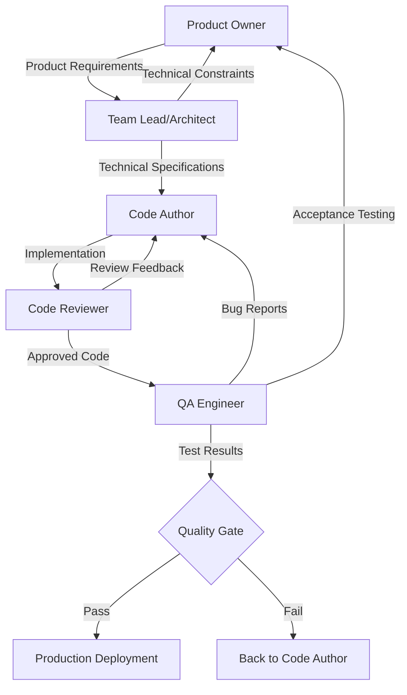

# InsightLoop Development Workflow

## Overview
This document outlines the collaborative workflow between all personas in the InsightLoop development process, ensuring seamless handoffs and quality delivery from product concept to production deployment.

## Development Process Flow



## Phase 1: Product Definition

### Product Owner → Team Lead/Architect

**Deliverables from Product Owner:**
- Product Requirements Document (PRD)
- User stories with acceptance criteria
- Business value and priority assessment
- Success metrics and KPIs

**Example Product Requirement:**
```markdown
# Feature: Advanced Search and Filtering

## Business Objective
Enable users to quickly find features across their entire product portfolio to improve productivity and decision-making.

## User Stories
- As a product manager, I want to search for features by name and description so I can quickly locate specific functionality
- As a team lead, I want to filter features by status and priority so I can focus on current sprint work
- As an executive, I want to search across all companies so I can get a global view of feature development

## Acceptance Criteria
- Text search across feature names and descriptions
- Filter by status, priority, effort score, and business value
- Search suggestions with autocomplete
- Results paginated with max 50 items per page
- Response time < 500ms for typical queries

## Success Metrics
- Search usage adoption > 60% of active users within 30 days
- Average search result click-through rate > 40%
- User satisfaction score > 4.0/5.0
```

**Team Lead/Architect Response:**
- Technical feasibility assessment
- Effort estimation and timeline
- Architectural considerations and constraints
- Alternative implementation approaches

## Phase 2: Technical Design

### Team Lead/Architect → Code Author

**Deliverables from Team Lead/Architect:**

**High-Level Design (HLD):**
```markdown
# Advanced Search - High Level Design

## Architecture Overview
- API Layer: New search endpoints with filtering
- Service Layer: Search business logic and validation
- Repository Layer: Database queries with full-text search
- Frontend: Search UI components with real-time suggestions

## Technology Decisions
- PostgreSQL full-text search with GIN indexes
- Debounced search with React hooks
- Pagination with cursor-based approach
- Caching with Redis for frequent queries

## Performance Requirements
- Database: GIN index on tsvector(name || description)
- API: Response caching for 5 minutes
- Frontend: Debounce search input by 300ms
- Target: <500ms response time, <2s page load
```

**Low-Level Design (LLD):**
```typescript
// API Specification
interface SearchRequest {
  query?: string
  companyId?: string
  status?: FeatureStatus[]
  priority?: FeaturePriority[]
  limit?: number
  offset?: number
}

interface SearchResponse {
  features: Feature[]
  total: number
  hasMore: boolean
}

// Database Schema Changes
-- Add full-text search index
CREATE INDEX CONCURRENTLY idx_features_search 
ON features USING gin(to_tsvector('english', name || ' ' || description));

// Implementation Tasks
1. Repository: Add search method with filtering
2. Service: Add validation and business logic
3. API: Create /api/features/search endpoint
4. Components: SearchBar and SearchResults components
5. Hooks: useFeatureSearch with debouncing
6. Tests: Unit, integration, and E2E test coverage
```

## Phase 3: Implementation

### Code Author Development Process

**Implementation Steps:**
1. **Task Breakdown:** Review technical specifications and create implementation plan
2. **Test-Driven Development:** Write failing tests first
3. **Implementation:** Build functionality following specifications
4. **Self-Review:** Check against coding standards and requirements
5. **Documentation:** Update code comments and documentation

**Code Author Deliverables:**
```typescript
// Repository Implementation
export class FeatureRepository extends BaseRepository {
  async search(options: SearchOptions): Promise<SearchResult> {
    let query = this.supabase
      .from('features')
      .select(`
        *,
        product_area:product_areas(
          id, name,
          product:products(id, name, company:companies(id, name))
        )
      `, { count: 'exact' })

    // Text search implementation
    if (options.query) {
      query = query.or(`name.ilike.%${options.query}%,description.ilike.%${options.query}%`)
    }

    // Additional filtering logic...
    
    const { data, error, count } = await query
    if (error) throw error
    
    return {
      features: data || [],
      total: count || 0
    }
  }
}

// Comprehensive test coverage
describe('FeatureRepository.search', () => {
  it('should search by text query', async () => {
    // Test implementation
  })
  
  it('should filter by status', async () => {
    // Test implementation
  })
  
  // Additional test cases...
})
```

## Phase 4: Code Review

### Code Author → Code Reviewer

**Code Review Process:**

**1. Pull Request Submission:**
```markdown
## Pull Request: Advanced Search Implementation

### Changes
- Add search method to FeatureRepository with full-text search
- Create /api/features/search endpoint with filtering
- Implement SearchBar component with debounced input
- Add comprehensive test coverage (unit + integration + E2E)

### Testing
- [x] Unit tests pass (95% coverage)
- [x] Integration tests pass
- [x] E2E tests pass
- [x] Performance tests meet requirements (<500ms)

### Checklist
- [x] Follows TypeScript strict mode
- [x] Proper error handling implemented
- [x] Security considerations addressed
- [x] Accessibility standards met
- [x] Documentation updated
```

**2. Code Reviewer Feedback:**
```markdown
## Code Review Feedback

### ✅ Approved with Minor Suggestions

**Functionality** ✅
- Implementation correctly follows technical specifications
- All acceptance criteria properly addressed
- Error handling is comprehensive

**Code Quality** ✅
- TypeScript types are properly defined
- Code follows established patterns
- Good separation of concerns

**Suggestions** 🟡
1. Consider adding JSDoc comments to the search method for better documentation
2. The search query could benefit from SQL injection protection (use parameterized queries)
3. Add rate limiting consideration for the search endpoint

**Security** ✅
- Input validation is properly implemented
- Authentication checks are in place
- No SQL injection vulnerabilities detected

**Performance** ✅
- Database indexes are properly implemented
- Response caching strategy is sound
- Frontend debouncing is correctly implemented
```

**3. Code Author Response:**
- Address all blocking feedback
- Implement suggested improvements
- Update documentation as needed
- Re-request review when ready

## Phase 5: Quality Assurance

### Code Reviewer → QA Engineer

**QA Testing Process:**

**1. Test Plan Creation:**
```markdown
# Test Plan: Advanced Search Feature

## Functional Testing
### Happy Path Scenarios
- [ ] Search by feature name returns correct results
- [ ] Search by description returns relevant features
- [ ] Status filtering works correctly
- [ ] Priority filtering works correctly
- [ ] Pagination functions properly

### Edge Cases
- [ ] Empty search query handling
- [ ] Special characters in search query
- [ ] Very long search queries (>1000 characters)
- [ ] No results found scenarios
- [ ] Network timeout handling

### Error Scenarios
- [ ] Invalid filter combinations
- [ ] Malformed API requests
- [ ] Database connection failures
- [ ] Authentication errors
```

**2. Test Execution Results:**
```markdown
# Test Execution Report

## Summary
- **Total Test Cases**: 45
- **Passed**: 43
- **Failed**: 2
- **Blocked**: 0

## Failed Test Cases

### TC-023: Search Performance with Large Dataset
**Expected**: Search should complete within 500ms
**Actual**: Search takes 750ms with 10,000+ features
**Priority**: High
**Root Cause**: Missing database index on company_id + status combination

### TC-031: Accessibility - Screen Reader Navigation
**Expected**: Search results should be properly announced by screen reader
**Actual**: Results count is not announced to screen reader users
**Priority**: Medium
**Root Cause**: Missing aria-live region for result announcements
```

**3. Bug Reports and Feedback:**

### QA Engineer → Code Author

```markdown
## Bug Report #001

**Title**: Search Performance Degrades with Large Datasets

**Severity**: High
**Priority**: P1 (Must fix before release)

**Environment**: 
- Database: PostgreSQL with 10,000+ features
- Browser: Chrome 119.0

**Steps to Reproduce**:
1. Navigate to global search page
2. Enter search query "dashboard"
3. Apply status filter "in_progress"
4. Observe response time

**Expected Result**: Search completes within 500ms
**Actual Result**: Search takes 750ms

**Root Cause Analysis**:
Missing composite index on (company_id, status) for filtered queries

**Suggested Fix**:
```sql
CREATE INDEX CONCURRENTLY idx_features_company_status 
ON features(company_id, status);
```

**Verification Steps**:
1. Apply the database migration
2. Re-run performance tests
3. Verify response time < 500ms
```

## Phase 6: Bug Resolution

### Code Author Bug Fix Process

**1. Bug Analysis and Fix:**
```typescript
// Database Migration: Add missing index
-- File: supabase/migrations/20241106_add_search_performance_index.sql
CREATE INDEX CONCURRENTLY idx_features_company_status 
ON features(company_id, status);

CREATE INDEX CONCURRENTLY idx_features_company_priority 
ON features(company_id, priority);

// Accessibility Fix: Add aria-live region
export const SearchResults: React.FC<SearchResultsProps> = ({ 
  features, 
  total, 
  isLoading 
}) => {
  return (
    <div>
      {/* Add aria-live region for screen readers */}
      <div 
        aria-live="polite" 
        aria-atomic="true"
        className="sr-only"
      >
        {!isLoading && `Found ${total} features matching your search`}
      </div>
      
      <div className="space-y-4">
        {/* Search results */}
      </div>
    </div>
  )
}
```

**2. Re-testing and Validation:**

### QA Engineer → Product Owner

```markdown
# Final Test Report: Advanced Search Feature

## Verification Results
- [x] Performance issue resolved - avg response time: 425ms
- [x] Accessibility issue resolved - screen reader compatibility confirmed
- [x] All regression tests passed
- [x] User acceptance testing completed successfully

## Feature Validation
- [x] All acceptance criteria met
- [x] Business requirements satisfied
- [x] User experience meets expectations
- [x] Performance benchmarks achieved

## Recommendation: ✅ APPROVED FOR RELEASE
```

## Phase 7: Production Deployment

### Final Approval Workflow

**Product Owner Final Review:**
- [ ] Feature demonstrates business value
- [ ] User acceptance criteria fully met
- [ ] Performance meets requirements
- [ ] Ready for user announcement and training

**Team Lead/Architect Deployment Checklist:**
- [ ] Database migrations tested and ready
- [ ] Feature flags configured for gradual rollout
- [ ] Monitoring and alerting in place
- [ ] Rollback plan documented and tested

**Deployment Process:**
1. **Database Migration**: Apply indexes and schema changes
2. **Feature Deployment**: Deploy code with feature flag disabled
3. **Gradual Rollout**: Enable for 10% → 50% → 100% of users
4. **Monitoring**: Track performance, errors, and usage metrics
5. **Success Validation**: Confirm success metrics are met

## Communication Protocols

### Daily Standups
- **Status Updates**: Progress on current tasks
- **Blockers**: Issues requiring team assistance
- **Dependencies**: Cross-role coordination needs

### Weekly Reviews
- **Product Owner**: Feature progress and priority updates
- **Team Lead/Architect**: Technical debt and architecture improvements
- **QA Engineer**: Quality metrics and testing pipeline status

### Retrospectives
- **Process Improvements**: Workflow optimization opportunities
- **Tool Enhancements**: Development and testing tool improvements
- **Knowledge Sharing**: Cross-training and documentation updates

## Success Metrics

### Development Velocity
- Story points completed per sprint
- Lead time from requirements to production
- Code review turnaround time

### Quality Metrics
- Bug detection rate in review vs. production
- Test coverage percentage
- Performance benchmark compliance

### Collaboration Effectiveness
- Cross-role feedback quality scores
- Knowledge sharing frequency
- Process improvement implementation rate

This workflow ensures that each persona contributes their expertise while maintaining clear handoffs and quality gates throughout the development process, resulting in high-quality features that meet both business and technical requirements.
